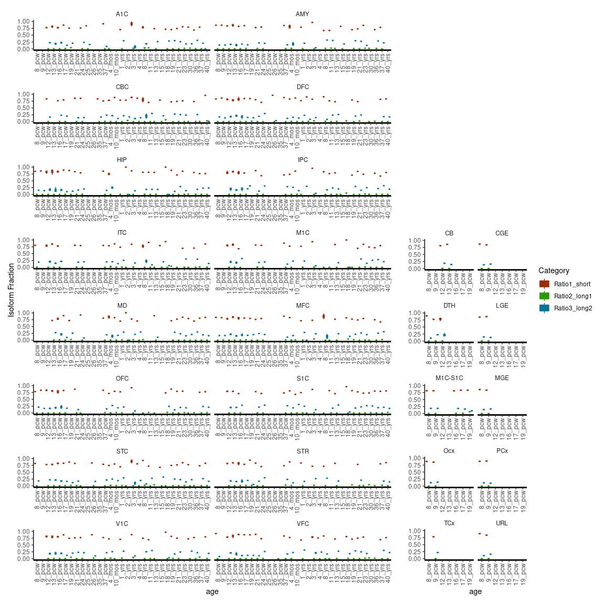
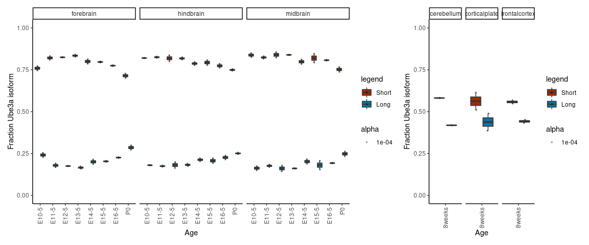

## Judson et al. 2021 (in preparation)

This repository contains `R` code to generate some of the figures
presented in Judson *et al.* 2020 (*in preparation*).

We used publicly available RNA-seq data in mouse and human to
demonstrate that the short isoform of UBE3A is expressed preferentially
over the long isoforms.

Mouse ENCODE RNA-seq alignment bigWig files for developmental timepoints
(E10.5 - P0) were downloaded from
[ENCODE](https://www.encodeproject.org) under project series
ENCSR505AHT, ENCSR328UYN, and ENCSR443OEA for midbrain, hindbrain, and
forebrain, respectively.

Alignment files corresponding to adult tissues were similarly downloaded
for experiments ENCSR000BZM, ENCSR000BZR, and ENCSR000BZS for
cerebellum, cortical plate, and frontal cortex, respectively.

Signal over exons corresponding to exons 3 and 4 (mm10 reference) were
tabulated using [deeptools
multiBigwigSummary](https://deeptools.readthedocs.io/en/develop/content/tools/multiBigwigSummary.html).

Isoform fractions were then computed in `R`, as demonstrated here. Error
bars represent the standard deviation in isoform fraction.

Human RNA-seq data summarized to exons were obtained from
[BrainSpan](http://www.brainspan.org/static/download.html), and filtered
for UBE3A exons as annotated by [Gencode
v10](https://www.gencodegenes.org/human/release_10.html).

Expression values were then averaged over developmental epochs for each
exon and broader brain area. Note that some brain regions are only
sampled from a small subset of developmental timepoints.

Epochs were defined as:

  - 1st trimester (8-13 pcw)
  - 2nd trimester (16-25 pcw)
  - 3rd trimester (26-37 pcw)
  - Early Postnatal (4 months - 2 years)
  - Early Childhood (3-11 years)
  - Adolescent (13-19 years)
  - Adult (19-40 years)

Brain areas were defined as:

  - Hippocampus (HIP)
  - Prefrontal Cortex (DFC, VFC, MFC, OFC)
  - Sensory Cortex (S1C, A1C, M1C, M1C-S1C)
  - Cerebellum (CB, CBC)
  - Thalamus (DTH, MD)

Signal from exons 3–7 were extracted as
    follows:

    * exon7 = "UBE3A_chr15_25620611_25620910"       exon 7  encodes MKRAAAK
    * exon6 = "UBE3A_chr15_25650607_25650653"       exon 6  encodes SGEP...M
    * exon5 = "UBE3A_chr15_25652213_25652284"       exon 5  noncoding
    * exon4 = "UBE3A_chr15_25653766_25653795"       exon 4  note this is a shorter form of other exons here that may be annotated as longer, encodes MEKL
    * exon3 = "UBE3A_chr15_25654234_25654354"       exon 3  encodes MATACKR

Isoform fractions were then computed in `R` as follows:

  - Ratio1\_short = ((exon6 - ((0.071\*exon4) + (0.322\*exon3)))/exon6)
  - Ratio2\_long1 = (0.071\*exon4)/exon6
  - Ratio3\_long2 = (0.322\*exon3)/exon6

unless the values of either exon3 or exon4 exceeded that of the common
exon6, in which case the ratios were set to NA and excluded

Error bars for human RNA-seq data represent the 95% confidence intervals
from 10,000 bootstrap samples of the data with replacement, and were
computed in `R` using the
[`rsample`](https://cran.r-project.org/web/packages/rsample/index.html)
package. Plots were generated in `R` version 3.6.0 and plotted with
`ggplot2`

## Load packages

    library(vctrs)
    library(rsample)
    library(tidyverse)
    library(magrittr)
    library(patchwork)

## Read in human data

The data from BrainSpan come as a set of 3 files:

  - `expression_matrix.csv` – the rows are genes and the columns
    samples; the first column is the row number
  - `rows_metadata.csv` – the exons are listed in the same order as the
    rows in expression\_matrix.csv
  - `columns_metadata.csv` – the samples are listed in the same order as
    the columns in expression\_matrix.csv

Here we have created a lookup table to annotate the UBE3A exons based on
their coordinates as follows:

`rows_metadata_UBE3A_lookup.txt`

    65047   UBE3A_chr15_25582380_25584404
    65048   UBE3A_chr15_25585231_25585375
    65049   UBE3A_chr15_25599499_25599573
    65050   UBE3A_chr15_25599674_25599830
    65051   UBE3A_chr15_25601038_25601203
    65052   UBE3A_chr15_25601837_25602043
    65053   UBE3A_chr15_25605529_25605674
    65054   UBE3A_chr15_25615712_25616959
    65055   UBE3A_chr15_25620611_25620910
    65056   UBE3A_chr15_25650607_25650653
    65057   UBE3A_chr15_25652213_25652284
    65058   UBE3A_chr15_25653766_25653795
    65059   UBE3A_chr15_25654234_25654354
    65060   UBE3A_chr15_25657054_25657118
    65061   UBE3A_chr15_25658157_25658175
    65062   UBE3A_chr15_25683635_25684128

We have also subset the expression matrix to contain just these UBE3A
exons, such that `expression_matrix_UBE3A.csv` contains only exons
65047-65062.

Now we can read in the data and begin to
tidy:

``` r
exp = read_csv("expression_matrix_UBE3A.csv",col_names = c("ExonID",seq(1:524)))
```

    ## Parsed with column specification:
    ## cols(
    ##   .default = col_double()
    ## )

    ## See spec(...) for full column specifications.

``` r
rows = read_tsv("rows_metadata_UBE3A_lookup.txt",col_names=c("ExonID","Name"))
```

    ## Parsed with column specification:
    ## cols(
    ##   ExonID = col_double(),
    ##   Name = col_character()
    ## )

``` r
exp_joined = full_join(rows,exp,by="ExonID")

cols = read_csv("columns_metadata.csv") %>% 
    mutate(age=str_replace_all(age," ","_")) %>% 
    select(c(column_num,donor_id,age,gender,structure_acronym))
```

    ## Parsed with column specification:
    ## cols(
    ##   column_num = col_double(),
    ##   donor_id = col_double(),
    ##   donor_name = col_character(),
    ##   age = col_character(),
    ##   gender = col_character(),
    ##   structure_id = col_double(),
    ##   structure_acronym = col_character(),
    ##   structure_name = col_character()
    ## )

``` r
exp_longer = exp_joined %>% 
    pivot_longer(3:dim(exp_joined)[2],names_to="column_num",values_to="Expression")

exp_longer$column_num %<>% as.integer
```

Next we can annotate the ages as each of the developmental epochs we
defined above

``` r
joined = full_join(cols,exp_longer,by="column_num")  %>%
    mutate(
        Epoch = case_when(
            age=="8_pcw" | age=="9_pcw" | age=="12_pcw" | age=="13_pcw" ~ "FirstTri",
            age=="16_pcw" | age=="17_pcw" | age=="19_pcw" | age=="21_pcw" | age=="24_pcw" | age=="25_pcw" ~ "SecondTri",
            age=="26_pcw" | age=="35_pcw" | age=="37_pcw" ~ "ThirdTri",
            age=="4_mos" | age=="10_mos" | age=="1_yrs" | age=="2_yrs" ~ "EarlyPost",
            age=="3_yrs" | age=="4_yrs" | age=="8_yrs" | age=="11_yrs" ~ "EarlyChild",
            age=="13_yrs" | age=="15_yrs" | age=="18_yrs" | age=="19_yrs" ~ "Adolescent",
            age=="19_yrs" | age=="21_yrs" | age=="23_yrs" | age=="30_yrs" | age=="36_yrs" | age=="37_yrs" | age=="40_yrs" ~ "Adult",
            T ~ "else"
            )
        )
```

Then we manually set the order that these ages and epochs should appear
in figures, and set a default jitter
width

``` r
order = c("8_pcw","9_pcw","12_pcw","13_pcw","16_pcw","17_pcw","19_pcw","21_pcw","24_pcw","25_pcw","26_pcw","35_pcw","37_pcw","4_mos","10_mos","1_yrs","2_yrs","3_yrs","4_yrs","8_yrs","11_yrs","13_yrs","15_yrs","18_yrs","19_yrs","21_yrs","23_yrs","30_yrs","36_yrs","37_yrs","40_yrs")
epoch_order = c("FirstTri","SecondTri","ThirdTri","EarlyPost","EarlyChild","Adolescent","Adult")
dodge = position_dodge(width=0.9)
nboot=100
```

    Note: Number of bootstraps set to 100 here, but for publication we ran 10,000 bootstraps

### Rename exons based on coordinates and isoform information

``` r
exon7 = "UBE3A_chr15_25620611_25620910"     # exon 7    # encodes MKRAAAK
exon6 = "UBE3A_chr15_25650607_25650653"     # exon 6    # encodes SGEP...M
exon5 = "UBE3A_chr15_25652213_25652284"     # exon 5    # noncoding
exon4 = "UBE3A_chr15_25653766_25653795"     # exon 4    # note this is a shorter form of other exons here that may be annotated as longer, encodes MEKL
exon3 = "UBE3A_chr15_25654234_25654354"     # exon 3    # encodes MATACKR

EOI = c(exon3,exon4,exon5,exon6,exon7)
```

### Summarize and plot data for whole brain

``` r
wholebrain_perm = joined %>% 
    mutate(Epoch = fct_relevel(Epoch,epoch_order)) %>%
    filter(Name %in% EOI) %>%
    group_by(Epoch,Name) %>%
    bootstraps(times=nboot)

wholebrain_err = map_dfr(wholebrain_perm$splits,
    function(x) {
        as_tibble(x) %>% 
        group_by(Epoch,Name) %>%
        summarize(MeanExp = mean(Expression)) %>% 
        pivot_wider(names_from=Name,values_from = MeanExp) %>%
        rename("exon7" = UBE3A_chr15_25620611_25620910, "exon6" = UBE3A_chr15_25650607_25650653, "exon5" = UBE3A_chr15_25652213_25652284, "exon4" = UBE3A_chr15_25653766_25653795, "exon3" = UBE3A_chr15_25654234_25654354) %>%
        mutate(
            Ratio3_long2 = case_when(
                exon3 <= exon6 ~ (0.322*exon3)/exon6,
                T ~ NA_real_
                ), 
            Ratio2_long1 = case_when(
                exon4 <= exon6 ~ (0.071*exon4)/exon6,
                T ~ NA_real_
            ), 
            Ratio1_short = case_when(
                exon3 <= exon6 & exon4 <= exon6 ~ ((exon6 - ((0.071*exon4) + (0.322*exon3)))/exon6),
                T ~ NA_real_
            )
        ) %>%
        select(Epoch,starts_with("Ratio")) %>%
        pivot_longer(names_to="Category",values_to="Ratio",cols=contains("Ratio"))      
    }) %>%
    group_by(Epoch,Category) %>%
    summarize(ratio.q025 = quantile(Ratio,0.025,na.rm=T), ratio.q975 = quantile(Ratio,0.975,na.rm=T))

wholebrain_obs = joined %>% 
    mutate(Epoch = fct_relevel(Epoch,epoch_order)) %>%
    group_by(Epoch,Name) %>% 
    summarize(MeanExp = mean(Expression)) %>% 
    filter(Name %in% EOI) %>%
    pivot_wider(names_from=Name,values_from = MeanExp) %>%
    rename("exon7" = UBE3A_chr15_25620611_25620910, "exon6" = UBE3A_chr15_25650607_25650653, "exon5" = UBE3A_chr15_25652213_25652284, "exon4" = UBE3A_chr15_25653766_25653795, "exon3" = UBE3A_chr15_25654234_25654354) %>%
    mutate(
        Ratio3_long2 = case_when(
            exon3 <= exon6 ~ (0.322*exon3)/exon6,
            T ~ NA_real_
            ), 
        Ratio2_long1 = case_when(
            exon4 <= exon6 ~ (0.071*exon4)/exon6,
            T ~ NA_real_
        ), 
        Ratio1_short = case_when(
            exon3 <= exon6 & exon4 <= exon6 ~ ((exon6 - ((0.071*exon4) + (0.322*exon3)))/exon6),
            T ~ NA_real_
        )
    ) %>%
    select(Epoch,starts_with("Ratio")) %>%
    pivot_longer(names_to="Category",values_to="Ratio",cols=contains("Ratio"))

wholebrain = full_join(wholebrain_obs,wholebrain_err) %>%
    ggplot(aes(x=Epoch,y=Ratio,fill=Category)) + 
    geom_col(position=dodge) +          # Take away position parameter to default to stacked bars
    geom_errorbar(aes(ymin=ratio.q025,ymax=ratio.q975),width=0.2,position=dodge) +  
    scale_x_discrete(limits = epoch_order) + 
    theme_classic() + 
    theme(axis.text.x = element_text(angle = 90, hjust = 1, vjust = 0.5)) +
    xlab("Donor age") +
    ylab("Fraction UBE3A isoform") +
    ylim(0,1) +
    ggtitle("Whole brain") +
    scale_fill_manual("legend", values = c("Ratio1_short" = "#9A2C06", "Ratio2_long1" = "#2A9A06", "Ratio3_long2" = "#06749A"))
```

    ## Joining, by = c("Epoch", "Category")

### Summarize and plot data for Hippocampus

``` r
hip_perm = joined %>% 
    filter(structure_acronym=="HIP") %>%
    mutate(Epoch = fct_relevel(Epoch,epoch_order)) %>%
    filter(Name %in% EOI) %>%
    group_by(Epoch,Name) %>%
    bootstraps(times=nboot)

hip_err = map_dfr(hip_perm$splits,
    function(x) {
        as_tibble(x) %>% 
        group_by(Epoch,Name) %>%
        summarize(MeanExp = mean(Expression)) %>% 
        pivot_wider(names_from=Name,values_from = MeanExp) %>%
        rename("exon7" = UBE3A_chr15_25620611_25620910, "exon6" = UBE3A_chr15_25650607_25650653, "exon5" = UBE3A_chr15_25652213_25652284, "exon4" = UBE3A_chr15_25653766_25653795, "exon3" = UBE3A_chr15_25654234_25654354) %>%
        mutate(
            Ratio3_long2 = case_when(
                exon3 <= exon6 ~ (0.322*exon3)/exon6,
                T ~ NA_real_
                ), 
            Ratio2_long1 = case_when(
                exon4 <= exon6 ~ (0.071*exon4)/exon6,
                T ~ NA_real_
            ), 
            Ratio1_short = case_when(
                exon3 <= exon6 & exon4 <= exon6 ~ ((exon6 - ((0.071*exon4) + (0.322*exon3)))/exon6),
                T ~ NA_real_
            )
        ) %>%
        select(Epoch,starts_with("Ratio")) %>%
        pivot_longer(names_to="Category",values_to="Ratio",cols=contains("Ratio"))      
    }) %>%
    group_by(Epoch,Category) %>%
    summarize(ratio.q025 = quantile(Ratio,0.025,na.rm=T), ratio.q975 = quantile(Ratio,0.975,na.rm=T))

hip_obs = joined %>% 
    filter(structure_acronym=="HIP") %>%
    mutate(Epoch = fct_relevel(Epoch,epoch_order)) %>%
    group_by(Epoch,Name) %>% 
    summarize(MeanExp = mean(Expression)) %>% 
    filter(Name %in% EOI) %>%
    pivot_wider(names_from=Name,values_from = MeanExp) %>%
    rename("exon7" = UBE3A_chr15_25620611_25620910, "exon6" = UBE3A_chr15_25650607_25650653, "exon5" = UBE3A_chr15_25652213_25652284, "exon4" = UBE3A_chr15_25653766_25653795, "exon3" = UBE3A_chr15_25654234_25654354) %>%
    mutate(
        Ratio3_long2 = case_when(
            exon3 <= exon6 ~ (0.322*exon3)/exon6,
            T ~ NA_real_
            ), 
        Ratio2_long1 = case_when(
            exon4 <= exon6 ~ (0.071*exon4)/exon6,
            T ~ NA_real_
        ), 
        Ratio1_short = case_when(
            exon3 <= exon6 & exon4 <= exon6 ~ ((exon6 - ((0.071*exon4) + (0.322*exon3)))/exon6),
            T ~ NA_real_
        )
    ) %>%
    select(Epoch,starts_with("Ratio")) %>%
    pivot_longer(names_to="Category",values_to="Ratio",cols=contains("Ratio"))

hip = full_join(hip_obs,hip_err) %>%
    ggplot(aes(x=Epoch,y=Ratio,fill=Category)) + 
    geom_col(position=dodge) +          # Take away position parameter to default to stacked bars
    geom_errorbar(aes(ymin=ratio.q025,ymax=ratio.q975),width=0.2,position=dodge) +  
    scale_x_discrete(limits = epoch_order) + 
    theme_classic() + 
    theme(axis.text.x = element_text(angle = 90, hjust = 1, vjust = 0.5)) +
    xlab("Donor age") +
    ylab("Fraction UBE3A isoform") +
    ylim(0,1) +
    ggtitle("Hippocampus") +
    scale_fill_manual("legend", values = c("Ratio1_short" = "#9A2C06", "Ratio2_long1" = "#2A9A06", "Ratio3_long2" = "#06749A"))
```

    ## Joining, by = c("Epoch", "Category")

### Summarize and plot data for Prefrontal cortex

``` r
pfc_perm = joined %>% 
    filter(structure_acronym=="DFC" | structure_acronym=="VFC" | structure_acronym=="MFC" | structure_acronym=="OFC") %>%
    mutate(Epoch = fct_relevel(Epoch,epoch_order)) %>%
    filter(Name %in% EOI) %>%
    group_by(Epoch,Name) %>%
    bootstraps(times=nboot)

pfc_err = map_dfr(pfc_perm$splits,
    function(x) {
        as_tibble(x) %>% 
        group_by(Epoch,Name) %>%
        summarize(MeanExp = mean(Expression)) %>% 
        pivot_wider(names_from=Name,values_from = MeanExp) %>%
        rename("exon7" = UBE3A_chr15_25620611_25620910, "exon6" = UBE3A_chr15_25650607_25650653, "exon5" = UBE3A_chr15_25652213_25652284, "exon4" = UBE3A_chr15_25653766_25653795, "exon3" = UBE3A_chr15_25654234_25654354) %>%
        mutate(
            Ratio3_long2 = case_when(
                exon3 <= exon6 ~ (0.322*exon3)/exon6,
                T ~ NA_real_
                ), 
            Ratio2_long1 = case_when(
                exon4 <= exon6 ~ (0.071*exon4)/exon6,
                T ~ NA_real_
            ), 
            Ratio1_short = case_when(
                exon3 <= exon6 & exon4 <= exon6 ~ ((exon6 - ((0.071*exon4) + (0.322*exon3)))/exon6),
                T ~ NA_real_
            )
        ) %>%
        select(Epoch,starts_with("Ratio")) %>%
        pivot_longer(names_to="Category",values_to="Ratio",cols=contains("Ratio"))      
    }) %>%
    group_by(Epoch,Category) %>%
    summarize(ratio.q025 = quantile(Ratio,0.025,na.rm=T), ratio.q975 = quantile(Ratio,0.975,na.rm=T))

pfc_obs = joined %>% 
    filter(structure_acronym=="DFC" | structure_acronym=="VFC" | structure_acronym=="MFC" | structure_acronym=="OFC") %>%
    mutate(Epoch = fct_relevel(Epoch,epoch_order)) %>%
    group_by(Epoch,Name) %>% 
    summarize(MeanExp = mean(Expression)) %>% 
    filter(Name %in% EOI) %>%
    pivot_wider(names_from=Name,values_from = MeanExp) %>%
    rename("exon7" = UBE3A_chr15_25620611_25620910, "exon6" = UBE3A_chr15_25650607_25650653, "exon5" = UBE3A_chr15_25652213_25652284, "exon4" = UBE3A_chr15_25653766_25653795, "exon3" = UBE3A_chr15_25654234_25654354) %>%
    mutate(
        Ratio3_long2 = case_when(
            exon3 <= exon6 ~ (0.322*exon3)/exon6,
            T ~ NA_real_
            ), 
        Ratio2_long1 = case_when(
            exon4 <= exon6 ~ (0.071*exon4)/exon6,
            T ~ NA_real_
        ), 
        Ratio1_short = case_when(
            exon3 <= exon6 & exon4 <= exon6 ~ ((exon6 - ((0.071*exon4) + (0.322*exon3)))/exon6),
            T ~ NA_real_
        )
    ) %>%
    select(Epoch,starts_with("Ratio")) %>%
    pivot_longer(names_to="Category",values_to="Ratio",cols=contains("Ratio"))

pfc = full_join(pfc_obs,pfc_err) %>%
    ggplot(aes(x=Epoch,y=Ratio,fill=Category)) + 
    geom_col(position=dodge) +          # Take away position parameter to default to stacked bars
    geom_errorbar(aes(ymin=ratio.q025,ymax=ratio.q975),width=0.2,position=dodge) +  
    scale_x_discrete(limits = epoch_order) + 
    theme_classic() + 
    theme(axis.text.x = element_text(angle = 90, hjust = 1, vjust = 0.5)) +
    xlab("Donor age") +
    ylab("Fraction UBE3A isoform") +
    ylim(0,1) +
    ggtitle("Prefrontal cortex") +
    scale_fill_manual("legend", values = c("Ratio1_short" = "#9A2C06", "Ratio2_long1" = "#2A9A06", "Ratio3_long2" = "#06749A"))
```

    ## Joining, by = c("Epoch", "Category")

### Summarize and plot data for Sensory cortex

``` r
sensory_perm = joined %>% 
    filter(structure_acronym=="S1C" | structure_acronym=="A1C" | structure_acronym=="M1C" | structure_acronym=="M1C-S1C") %>%
    mutate(Epoch = fct_relevel(Epoch,epoch_order)) %>%
    filter(Name %in% EOI) %>%
    group_by(Epoch,Name) %>%
    bootstraps(times=nboot)

sensory_err = map_dfr(sensory_perm$splits,
    function(x) {
        as_tibble(x) %>% 
        group_by(Epoch,Name) %>%
        summarize(MeanExp = mean(Expression)) %>% 
        pivot_wider(names_from=Name,values_from = MeanExp) %>%
        rename("exon7" = UBE3A_chr15_25620611_25620910, "exon6" = UBE3A_chr15_25650607_25650653, "exon5" = UBE3A_chr15_25652213_25652284, "exon4" = UBE3A_chr15_25653766_25653795, "exon3" = UBE3A_chr15_25654234_25654354) %>%
        mutate(
            Ratio3_long2 = case_when(
                exon3 <= exon6 ~ (0.322*exon3)/exon6,
                T ~ NA_real_
                ), 
            Ratio2_long1 = case_when(
                exon4 <= exon6 ~ (0.071*exon4)/exon6,
                T ~ NA_real_
            ), 
            Ratio1_short = case_when(
                exon3 <= exon6 & exon4 <= exon6 ~ ((exon6 - ((0.071*exon4) + (0.322*exon3)))/exon6),
                T ~ NA_real_
            )
        ) %>%
        select(Epoch,starts_with("Ratio")) %>%
        pivot_longer(names_to="Category",values_to="Ratio",cols=contains("Ratio"))      
    }) %>%
    group_by(Epoch,Category) %>%
    summarize(ratio.q025 = quantile(Ratio,0.025,na.rm=T), ratio.q975 = quantile(Ratio,0.975,na.rm=T))

sensory_obs = joined %>% 
    filter(structure_acronym=="S1C" | structure_acronym=="A1C" | structure_acronym=="M1C" | structure_acronym=="M1C-S1C") %>%
    mutate(Epoch = fct_relevel(Epoch,epoch_order)) %>%
    group_by(Epoch,Name) %>% 
    summarize(MeanExp = mean(Expression)) %>% 
    filter(Name %in% EOI) %>%
    pivot_wider(names_from=Name,values_from = MeanExp) %>%
    rename("exon7" = UBE3A_chr15_25620611_25620910, "exon6" = UBE3A_chr15_25650607_25650653, "exon5" = UBE3A_chr15_25652213_25652284, "exon4" = UBE3A_chr15_25653766_25653795, "exon3" = UBE3A_chr15_25654234_25654354) %>%
    mutate(
        Ratio3_long2 = case_when(
            exon3 <= exon6 ~ (0.322*exon3)/exon6,
            T ~ NA_real_
            ), 
        Ratio2_long1 = case_when(
            exon4 <= exon6 ~ (0.071*exon4)/exon6,
            T ~ NA_real_
        ), 
        Ratio1_short = case_when(
            exon3 <= exon6 & exon4 <= exon6 ~ ((exon6 - ((0.071*exon4) + (0.322*exon3)))/exon6),
            T ~ NA_real_
        )
    ) %>%
    select(Epoch,starts_with("Ratio")) %>%
    pivot_longer(names_to="Category",values_to="Ratio",cols=contains("Ratio"))

sensory = full_join(sensory_obs,sensory_err) %>%
    ggplot(aes(x=Epoch,y=Ratio,fill=Category)) + 
    geom_col(position=dodge) +          # Take away position parameter to default to stacked bars
    geom_errorbar(aes(ymin=ratio.q025,ymax=ratio.q975),width=0.2,position=dodge) +  
    scale_x_discrete(limits = epoch_order) + 
    theme_classic() + 
    theme(axis.text.x = element_text(angle = 90, hjust = 1, vjust = 0.5)) +
    xlab("Donor age") +
    ylab("Fraction UBE3A isoform") +
    ylim(0,1) +
    ggtitle("Sensory cortex") +
    scale_fill_manual("legend", values = c("Ratio1_short" = "#9A2C06", "Ratio2_long1" = "#2A9A06", "Ratio3_long2" = "#06749A"))
```

    ## Joining, by = c("Epoch", "Category")

### Summarize and plot data for Cerebellum

``` r
cbm_perm = joined %>% 
    filter(structure_acronym=="CB" | structure_acronym=="CBC") %>%
    mutate(Epoch = fct_relevel(Epoch,epoch_order)) %>%
    filter(Name %in% EOI) %>%
    group_by(Epoch,Name) %>%
    bootstraps(times=nboot)

cbm_err = map_dfr(cbm_perm$splits,
    function(x) {
        as_tibble(x) %>% 
        group_by(Epoch,Name) %>%
        summarize(MeanExp = mean(Expression)) %>% 
        pivot_wider(names_from=Name,values_from = MeanExp) %>%
        rename("exon7" = UBE3A_chr15_25620611_25620910, "exon6" = UBE3A_chr15_25650607_25650653, "exon5" = UBE3A_chr15_25652213_25652284, "exon4" = UBE3A_chr15_25653766_25653795, "exon3" = UBE3A_chr15_25654234_25654354) %>%
        mutate(
            Ratio3_long2 = case_when(
                exon3 <= exon6 ~ (0.322*exon3)/exon6,
                T ~ NA_real_
                ), 
            Ratio2_long1 = case_when(
                exon4 <= exon6 ~ (0.071*exon4)/exon6,
                T ~ NA_real_
            ), 
            Ratio1_short = case_when(
                exon3 <= exon6 & exon4 <= exon6 ~ ((exon6 - ((0.071*exon4) + (0.322*exon3)))/exon6),
                T ~ NA_real_
            )
        ) %>%
        select(Epoch,starts_with("Ratio")) %>%
        pivot_longer(names_to="Category",values_to="Ratio",cols=contains("Ratio"))      
    }) %>%
    group_by(Epoch,Category) %>%
    summarize(ratio.q025 = quantile(Ratio,0.025,na.rm=T), ratio.q975 = quantile(Ratio,0.975,na.rm=T))

cbm_obs = joined %>% 
    filter(structure_acronym=="CB" | structure_acronym=="CBC") %>%
    mutate(Epoch = fct_relevel(Epoch,epoch_order)) %>%
    group_by(Epoch,Name) %>% 
    summarize(MeanExp = mean(Expression)) %>% 
    filter(Name %in% EOI) %>%
    pivot_wider(names_from=Name,values_from = MeanExp) %>%
    rename("exon7" = UBE3A_chr15_25620611_25620910, "exon6" = UBE3A_chr15_25650607_25650653, "exon5" = UBE3A_chr15_25652213_25652284, "exon4" = UBE3A_chr15_25653766_25653795, "exon3" = UBE3A_chr15_25654234_25654354) %>%
    mutate(
        Ratio3_long2 = case_when(
            exon3 <= exon6 ~ (0.322*exon3)/exon6,
            T ~ NA_real_
            ), 
        Ratio2_long1 = case_when(
            exon4 <= exon6 ~ (0.071*exon4)/exon6,
            T ~ NA_real_
        ), 
        Ratio1_short = case_when(
            exon3 <= exon6 & exon4 <= exon6 ~ ((exon6 - ((0.071*exon4) + (0.322*exon3)))/exon6),
            T ~ NA_real_
        )
    ) %>%
    select(Epoch,starts_with("Ratio")) %>%
    pivot_longer(names_to="Category",values_to="Ratio",cols=contains("Ratio"))

cbm = full_join(cbm_obs,cbm_err) %>%
    ggplot(aes(x=Epoch,y=Ratio,fill=Category)) + 
    geom_col(position=dodge) +          # Take away position parameter to default to stacked bars
    geom_errorbar(aes(ymin=ratio.q025,ymax=ratio.q975),width=0.2,position=dodge) +  
    scale_x_discrete(limits = epoch_order) + 
    theme_classic() + 
    theme(axis.text.x = element_text(angle = 90, hjust = 1, vjust = 0.5)) +
    xlab("Donor age") +
    ylab("Fraction UBE3A isoform") +
    ylim(0,1) +
    ggtitle("Cerebellum") +
    scale_fill_manual("legend", values = c("Ratio1_short" = "#9A2C06", "Ratio2_long1" = "#2A9A06", "Ratio3_long2" = "#06749A"))
```

    ## Joining, by = c("Epoch", "Category")

### Summarize and plot data for Thalamus

``` r
thalamus_perm = joined %>% 
    filter(structure_acronym=="DTH" | structure_acronym=="MD") %>%
    mutate(Epoch = fct_relevel(Epoch,epoch_order)) %>%
    filter(Name %in% EOI) %>%
    group_by(Epoch,Name) %>%
    bootstraps(times=nboot)

thalamus_err = map_dfr(thalamus_perm$splits,
    function(x) {
        as_tibble(x) %>% 
        group_by(Epoch,Name) %>%
        summarize(MeanExp = mean(Expression)) %>% 
        pivot_wider(names_from=Name,values_from = MeanExp) %>%
        rename("exon7" = UBE3A_chr15_25620611_25620910, "exon6" = UBE3A_chr15_25650607_25650653, "exon5" = UBE3A_chr15_25652213_25652284, "exon4" = UBE3A_chr15_25653766_25653795, "exon3" = UBE3A_chr15_25654234_25654354) %>%
        mutate(
            Ratio3_long2 = case_when(
                exon3 <= exon6 ~ (0.322*exon3)/exon6,
                T ~ NA_real_
                ), 
            Ratio2_long1 = case_when(
                exon4 <= exon6 ~ (0.071*exon4)/exon6,
                T ~ NA_real_
            ), 
            Ratio1_short = case_when(
                exon3 <= exon6 & exon4 <= exon6 ~ ((exon6 - ((0.071*exon4) + (0.322*exon3)))/exon6),
                T ~ NA_real_
            )
        ) %>%
        select(Epoch,starts_with("Ratio")) %>%
        pivot_longer(names_to="Category",values_to="Ratio",cols=contains("Ratio"))      
    }) %>%
    group_by(Epoch,Category) %>%
    summarize(ratio.q025 = quantile(Ratio,0.025,na.rm=T), ratio.q975 = quantile(Ratio,0.975,na.rm=T))

thalamus_obs = joined %>% 
    filter(structure_acronym=="DTH" | structure_acronym=="MD") %>%
    mutate(Epoch = fct_relevel(Epoch,epoch_order)) %>%
    group_by(Epoch,Name) %>% 
    summarize(MeanExp = mean(Expression)) %>% 
    filter(Name %in% EOI) %>%
    pivot_wider(names_from=Name,values_from = MeanExp) %>%
    rename("exon7" = UBE3A_chr15_25620611_25620910, "exon6" = UBE3A_chr15_25650607_25650653, "exon5" = UBE3A_chr15_25652213_25652284, "exon4" = UBE3A_chr15_25653766_25653795, "exon3" = UBE3A_chr15_25654234_25654354) %>%
    mutate(
        Ratio3_long2 = case_when(
            exon3 <= exon6 ~ (0.322*exon3)/exon6,
            T ~ NA_real_
            ), 
        Ratio2_long1 = case_when(
            exon4 <= exon6 ~ (0.071*exon4)/exon6,
            T ~ NA_real_
        ), 
        Ratio1_short = case_when(
            exon3 <= exon6 & exon4 <= exon6 ~ ((exon6 - ((0.071*exon4) + (0.322*exon3)))/exon6),
            T ~ NA_real_
        )
    ) %>%
    select(Epoch,starts_with("Ratio")) %>%
    pivot_longer(names_to="Category",values_to="Ratio",cols=contains("Ratio"))

thalamus = full_join(thalamus_obs,thalamus_err) %>%
    ggplot(aes(x=Epoch,y=Ratio,fill=Category)) + 
    geom_col(position=dodge) +          # Take away position parameter to default to stacked bars
    geom_errorbar(aes(ymin=ratio.q025,ymax=ratio.q975),width=0.2,position=dodge) +  
    scale_x_discrete(limits = epoch_order) + 
    theme_classic() + 
    theme(axis.text.x = element_text(angle = 90, hjust = 1, vjust = 0.5)) +
    xlab("Donor age") +
    ylab("Fraction UBE3A isoform") +
    ylim(0,1) +
    ggtitle("Thalamus") +
    scale_fill_manual("legend", values = c("Ratio1_short" = "#9A2C06", "Ratio2_long1" = "#2A9A06", "Ratio3_long2" = "#06749A"))
```

    ## Joining, by = c("Epoch", "Category")

### Write out all summary plots to one figure using patchwork

``` r
(hip+pfc+sensory)/(cbm+thalamus+wholebrain)
```

    ## Warning: Removed 2 rows containing missing values (geom_col).

<!-- -->

``` r
# Note thalamus has two NA ratios in the early childhood epoch
```

### Plot all individual brain regions and timepoints as boxplots for supplementary material

``` r
left = joined %>% 
    filter(Name %in% EOI) %>%
    select(-ExonID) %>%
    pivot_wider(names_from=Name,values_from = Expression) %>% 
    rename("exon7" = UBE3A_chr15_25620611_25620910, "exon6" = UBE3A_chr15_25650607_25650653, "exon5" = UBE3A_chr15_25652213_25652284, "exon4" = UBE3A_chr15_25653766_25653795, "exon3" = UBE3A_chr15_25654234_25654354) %>%
    mutate(
        Ratio3_long2 = case_when(
            exon3 <= exon6 ~ (0.322*exon3)/exon6,
            T ~ NA_real_
            ), 
        Ratio2_long1 = case_when(
            exon4 <= exon6 ~ (0.071*exon4)/exon6,
            T ~ NA_real_
        ), 
        Ratio1_short = case_when(
            exon3 <= exon6 & exon4 <= exon6 ~ ((exon6 - ((0.071*exon4) + (0.322*exon3)))/exon6),
            T ~ NA_real_
        )
    ) %>%
    select(-starts_with("UBE3A")) %>%
    pivot_longer(names_to="Category",values_to="Ratio",cols=contains("Ratio")) %>%
    filter(structure_acronym == "A1C" | structure_acronym == "AMY" | structure_acronym == "CBC" | structure_acronym == "DFC" | structure_acronym == "HIP" | structure_acronym == "IPC" | structure_acronym == "ITC" | structure_acronym == "M1C" | structure_acronym == "MD" | structure_acronym == "MFC" | structure_acronym == "OFC" | structure_acronym == "S1C" | structure_acronym == "STC" | structure_acronym == "STR" | structure_acronym == "V1C" | structure_acronym == "VFC") %>%
    ggplot(aes(x=age,y=Ratio,fill=Category)) + 
    geom_boxplot(aes(color=Category)) + 
    facet_wrap(~structure_acronym,nrow=8,ncol=2,as.table=T, strip.position = "top",scales="free_x") + 
    theme_classic() + 
    theme(axis.text.x = element_text(angle = 90, hjust = 1, vjust = 0.5),legend.position = "none",strip.background = element_blank(), strip.placement = NULL,axis.line.x = element_line(colour = 'black', size=1, linetype='solid'),panel.grid.major = element_blank(), panel.grid.minor = element_blank()) +
    scale_x_discrete(limits = order) +
    scale_fill_manual(values = c("Ratio1_short" = "#9A2C06", "Ratio2_long1" = "#2A9A06", "Ratio3_long2" = "#06749A")) +
    scale_color_manual(values = c("Ratio1_short" = "#9A2C06", "Ratio2_long1" = "#2A9A06", "Ratio3_long2" = "#06749A")) +
    ylim(0,1) +
    ylab("Isoform Fraction")

right = joined %>% 
    filter(Name %in% EOI) %>%
    select(-ExonID) %>%
    pivot_wider(names_from=Name,values_from = Expression) %>% 
    rename("exon7" = UBE3A_chr15_25620611_25620910, "exon6" = UBE3A_chr15_25650607_25650653, "exon5" = UBE3A_chr15_25652213_25652284, "exon4" = UBE3A_chr15_25653766_25653795, "exon3" = UBE3A_chr15_25654234_25654354) %>%
    mutate(
        Ratio3_long2 = case_when(
            exon3 <= exon6 ~ (0.322*exon3)/exon6,
            T ~ NA_real_
            ), 
        Ratio2_long1 = case_when(
            exon4 <= exon6 ~ (0.071*exon4)/exon6,
            T ~ NA_real_
        ), 
        Ratio1_short = case_when(
            exon3 <= exon6 & exon4 <= exon6 ~ ((exon6 - ((0.071*exon4) + (0.322*exon3)))/exon6),
            T ~ NA_real_
        )
    ) %>%
    select(-starts_with("UBE3A")) %>%
    pivot_longer(names_to="Category",values_to="Ratio",cols=contains("Ratio")) %>%
    filter(structure_acronym == "CB" | structure_acronym == "CGE" | structure_acronym == "DTH" | structure_acronym == "LGE" | structure_acronym == "M1C-S1C" | structure_acronym == "MGE" | structure_acronym == "Ocx" | structure_acronym == "PCx" | structure_acronym == "TCx" | structure_acronym == "URL") %>%
    ggplot(aes(x=age,y=Ratio,fill=Category)) + 
    geom_boxplot(aes(color=Category)) + 
    facet_wrap(~structure_acronym,nrow=5,ncol=2,as.table=T, strip.position = "top",scales="free_x") + 
    theme_classic() + 
    theme(axis.text.x = element_text(angle = 90, hjust = 1, vjust = 0.5),strip.background = element_blank(), strip.placement = NULL,axis.line.x = element_line(colour = 'black', size=1, linetype='solid'),panel.grid.major = element_blank(), panel.grid.minor = element_blank()) +
    scale_x_discrete(limits = order[1:7]) +
    scale_fill_manual(values = c("Ratio1_short" = "#9A2C06", "Ratio2_long1" = "#2A9A06", "Ratio3_long2" = "#06749A")) +
    scale_color_manual(values = c("Ratio1_short" = "#9A2C06", "Ratio2_long1" = "#2A9A06", "Ratio3_long2" = "#06749A")) +
    ylim(0,1) +
    ylab("")

layout <- "
AAAAAAA##
AAAAAAA##
AAAAAAA##
AAAAAAABB
AAAAAAABB
AAAAAAABB
AAAAAAABB
AAAAAAABB
"
left + right + plot_layout(design=layout,heights=c(1,0.8244),guides = 'collect')
```

    ## Warning: Removed 183 rows containing non-finite values (stat_boxplot).

<!-- -->

``` r
# Note 0.8244 is a magic scaling factor here such that the y axis values and lines are aligned exactly
```

-----

## Read in mouse data

The data from ENCODE come as a set of bigWig files, and the downloads do
not preserve meaningful sample names. We renamed them as follows:

    ENCFF739IFQ.bigWig  Mouse_E11-5_midbrain_RNA_Rep1.bigWig
    ENCFF933JNJ.bigWig  Mouse_E11-5_midbrain_RNA_Rep2.bigWig
    ENCFF931YZK.bigWig  Mouse_E12-5_midbrain_RNA_Rep1.bigWig
    ENCFF314WTG.bigWig  Mouse_E12-5_midbrain_RNA_Rep2.bigWig
    ENCFF864PZZ.bigWig  Mouse_E16-5_midbrain_RNA_Rep1.bigWig
    ENCFF156ZZJ.bigWig  Mouse_E16-5_midbrain_RNA_Rep2.bigWig
    ENCFF750QEC.bigWig  Mouse_E13-5_midbrain_RNA_Rep1.bigWig
    ENCFF670KUK.bigWig  Mouse_E13-5_midbrain_RNA_Rep2.bigWig
    ENCFF931VUS.bigWig  Mouse_E10-5_midbrain_RNA_Rep1.bigWig
    ENCFF419AKF.bigWig  Mouse_E10-5_midbrain_RNA_Rep2.bigWig
    ENCFF398USF.bigWig  Mouse_P0_midbrain_RNA_Rep1.bigWig
    ENCFF494IKM.bigWig  Mouse_P0_midbrain_RNA_Rep2.bigWig
    ENCFF112LWR.bigWig  Mouse_E14-5_midbrain_RNA_Rep1.bigWig
    ENCFF957OON.bigWig  Mouse_E14-5_midbrain_RNA_Rep2.bigWig
    ENCFF287UJS.bigWig  Mouse_E15-5_midbrain_RNA_Rep1.bigWig
    ENCFF234TQI.bigWig  Mouse_E15-5_midbrain_RNA_Rep2.bigWig
    ENCFF622NTO.bigWig  Mouse_E11-5_hindbrain_RNA_Rep1.bigWig
    ENCFF568XIY.bigWig  Mouse_E11-5_hindbrain_RNA_Rep2.bigWig
    ENCFF852ZHY.bigWig  Mouse_P0_hindbrain_RNA_Rep1.bigWig
    ENCFF387KWS.bigWig  Mouse_P0_hindbrain_RNA_Rep2.bigWig
    ENCFF235YXS.bigWig  Mouse_E12-5_hindbrain_RNA_Rep1.bigWig
    ENCFF422MYW.bigWig  Mouse_E12-5_hindbrain_RNA_Rep2.bigWig
    ENCFF372BPJ.bigWig  Mouse_E13-5_hindbrain_RNA_Rep1.bigWig
    ENCFF308BKU.bigWig  Mouse_E13-5_hindbrain_RNA_Rep2.bigWig
    ENCFF804RYC.bigWig  Mouse_E16-5_hindbrain_RNA_Rep1.bigWig
    ENCFF556CUO.bigWig  Mouse_E16-5_hindbrain_RNA_Rep2.bigWig
    ENCFF215SES.bigWig  Mouse_E15-5_hindbrain_RNA_Rep1.bigWig
    ENCFF574ADS.bigWig  Mouse_E15-5_hindbrain_RNA_Rep2.bigWig
    ENCFF965BZR.bigWig  Mouse_E10-5_hindbrain_RNA_Rep1.bigWig
    ENCFF844SJF.bigWig  Mouse_E10-5_hindbrain_RNA_Rep2.bigWig
    ENCFF484FNM.bigWig  Mouse_E14-5_hindbrain_RNA_Rep1.bigWig
    ENCFF222ONA.bigWig  Mouse_E14-5_hindbrain_RNA_Rep2.bigWig
    ENCFF275ARE.bigWig  Mouse_E11-5_forebrain_RNA_Rep1.bigWig
    ENCFF010POZ.bigWig  Mouse_E11-5_forebrain_RNA_Rep2.bigWig
    ENCFF527YNH.bigWig  Mouse_E12-5_forebrain_RNA_Rep1.bigWig
    ENCFF793AHG.bigWig  Mouse_E12-5_forebrain_RNA_Rep2.bigWig
    ENCFF242VUV.bigWig  Mouse_E14-5_forebrain_RNA_Rep1.bigWig
    ENCFF136BXC.bigWig  Mouse_E14-5_forebrain_RNA_Rep2.bigWig
    ENCFF130CQI.bigWig  Mouse_E16-5_forebrain_RNA_Rep1.bigWig
    ENCFF459EHB.bigWig  Mouse_E16-5_forebrain_RNA_Rep2.bigWig
    ENCFF370MZR.bigWig  Mouse_E15-5_forebrain_RNA_Rep1.bigWig
    ENCFF599MHQ.bigWig  Mouse_E15-5_forebrain_RNA_Rep2.bigWig
    ENCFF046NCT.bigWig  Mouse_E10-5_forebrain_RNA_Rep1.bigWig
    ENCFF252SXR.bigWig  Mouse_E10-5_forebrain_RNA_Rep2.bigWig
    ENCFF190EHR.bigWig  Mouse_P0_forebrain_RNA_Rep1.bigWig
    ENCFF372TAA.bigWig  Mouse_P0_forebrain_RNA_Rep2.bigWig
    ENCFF652LRB.bigWig  Mouse_E13-5_forebrain_RNA_Rep1.bigWig
    ENCFF796UNM.bigWig  Mouse_E13-5_forebrain_RNA_Rep2.bigWig
    ENCFF042QUM.bigWig  Mouse_8weeks_cerebellum_RNA_Rep1.bigWig
    ENCFF617YNX.bigWig  Mouse_8weeks_cerebellum_RNA_Rep2.bigWig
    ENCFF842OHF.bigWig  Mouse_8weeks_corticalplate_RNA_Rep1.bigWig
    ENCFF595GCD.bigWig  Mouse_8weeks_corticalplate_RNA_Rep2.bigWig
    ENCFF195XVM.bigWig  Mouse_8weeks_frontalcortex_RNA_Rep1.bigWig
    ENCFF659CEH.bigWig  Mouse_8weeks_frontalcortex_RNA_Rep2.bigWig

We then ran deeptools multiBigWigSummary to compute exon level
    coverages

    multiBigwigSummary BED-file -b Mouse_8weeks_cerebellum_RNA_Rep1.bigWig Mouse_8weeks_cerebellum_RNA_Rep2.bigWig Mouse_8weeks_corticalplate_RNA_Rep1.bigWig Mouse_8weeks_corticalplate_RNA_Rep2.bigWig Mouse_8weeks_frontalcortex_RNA_Rep1.bigWig Mouse_8weeks_frontalcortex_RNA_Rep2.bigWig Mouse_E10-5_forebrain_RNA_Rep1.bigWig Mouse_E10-5_forebrain_RNA_Rep2.bigWig Mouse_E10-5_hindbrain_RNA_Rep1.bigWig Mouse_E10-5_hindbrain_RNA_Rep2.bigWig Mouse_E10-5_midbrain_RNA_Rep1.bigWig Mouse_E10-5_midbrain_RNA_Rep2.bigWig Mouse_E11-5_forebrain_RNA_Rep1.bigWig Mouse_E11-5_forebrain_RNA_Rep2.bigWig Mouse_E11-5_hindbrain_RNA_Rep1.bigWig Mouse_E11-5_hindbrain_RNA_Rep2.bigWig Mouse_E11-5_midbrain_RNA_Rep1.bigWig Mouse_E11-5_midbrain_RNA_Rep2.bigWig Mouse_E12-5_forebrain_RNA_Rep1.bigWig Mouse_E12-5_forebrain_RNA_Rep2.bigWig Mouse_E12-5_hindbrain_RNA_Rep1.bigWig Mouse_E12-5_hindbrain_RNA_Rep2.bigWig Mouse_E12-5_midbrain_RNA_Rep1.bigWig Mouse_E12-5_midbrain_RNA_Rep2.bigWig Mouse_E13-5_forebrain_RNA_Rep1.bigWig Mouse_E13-5_forebrain_RNA_Rep2.bigWig Mouse_E13-5_hindbrain_RNA_Rep1.bigWig Mouse_E13-5_hindbrain_RNA_Rep2.bigWig Mouse_E13-5_midbrain_RNA_Rep1.bigWig Mouse_E13-5_midbrain_RNA_Rep2.bigWig Mouse_E14-5_forebrain_RNA_Rep1.bigWig Mouse_E14-5_forebrain_RNA_Rep2.bigWig Mouse_E14-5_hindbrain_RNA_Rep1.bigWig Mouse_E14-5_hindbrain_RNA_Rep2.bigWig Mouse_E14-5_midbrain_RNA_Rep1.bigWig Mouse_E14-5_midbrain_RNA_Rep2.bigWig Mouse_E15-5_forebrain_RNA_Rep1.bigWig Mouse_E15-5_forebrain_RNA_Rep2.bigWig Mouse_E15-5_hindbrain_RNA_Rep1.bigWig Mouse_E15-5_hindbrain_RNA_Rep2.bigWig Mouse_E15-5_midbrain_RNA_Rep1.bigWig Mouse_E15-5_midbrain_RNA_Rep2.bigWig Mouse_E16-5_forebrain_RNA_Rep1.bigWig Mouse_E16-5_forebrain_RNA_Rep2.bigWig Mouse_E16-5_hindbrain_RNA_Rep1.bigWig Mouse_E16-5_hindbrain_RNA_Rep2.bigWig Mouse_E16-5_midbrain_RNA_Rep1.bigWig Mouse_E16-5_midbrain_RNA_Rep2.bigWig Mouse_P0_forebrain_RNA_Rep1.bigWig Mouse_P0_forebrain_RNA_Rep2.bigWig Mouse_P0_hindbrain_RNA_Rep1.bigWig Mouse_P0_hindbrain_RNA_Rep2.bigWig Mouse_P0_midbrain_RNA_Rep1.bigWig Mouse_P0_midbrain_RNA_Rep2.bigWig -o ENCODE_mouse_dev_timecourse_bigWigSummary_Ube3a_isoforms.npz -p 4 --outRawCounts ENCODE_mouse_dev_timecourse_bigWigSummary_Ube3a_isoforms.rawcounts.tab --smartLabels --BED ube3a.bed

Where `ube3a.bed` contains the following information about isoform start
sites:

    chr7    59243350        59243469        exon3
    chr7    59247173        59247217        exon4

The header line of the `.tab` output from deeptools was cleaned up
slightly to give us the file provided here
`ENCODE_mouse_dev_timecourse_bigWigSummary_Ube3a_isoforms.rawcounts.txt`,
which we can now read into
`R`

``` r
counts = read_tsv("ENCODE_mouse_dev_timecourse_bigWigSummary_Ube3a_isoforms.rawcounts.txt")
```

    ## Parsed with column specification:
    ## cols(
    ##   .default = col_double(),
    ##   chr = col_character()
    ## )

    ## See spec(...) for full column specifications.

## Summarize and plot data for developmental timepoints

``` r
dev = counts %>%
    pivot_longer(cols=starts_with("Mouse_"),names_to="Sample",names_prefix="Mouse_",values_to="Expression") %>%
    separate(Sample,c("Age","Tissue","RNA","Replicate"),sep="_") %>%
    unite("Exon",c(chr,start,end)) %>%
    mutate(
        Isoform = case_when(
            Exon=="chr7_59243350_59243469" ~ "exon3",
            Exon=="chr7_59247173_59247217" ~ "exon4",
            T ~ "else"
            )
    ) %>%
    select(-RNA,-Exon) %>%
    pivot_wider(names_from=Isoform,values_from=Expression) %>%
    mutate(ShortFraction = (exon4-exon3)/exon4) %>%
    mutate(LongFraction = exon3/exon4) %>%
    select(-exon3,-exon4) %>%
    pivot_longer(names_to="Isoform",values_to="Fraction",cols=c(ShortFraction,LongFraction)) %>%
    mutate(Isoform=str_replace_all(Isoform,"Fraction","")) %>%
    mutate(Isoform=fct_relevel(Isoform,c("Short","Long"))) %>%
    group_by(Age,Tissue,Isoform) %>%
    summarize(Mean=mean(Fraction),SD=sd(Fraction)) %>%
    filter(Tissue=="hindbrain" | Tissue=="forebrain" | Tissue=="midbrain") %>%
    ggplot(aes(x=Age,y=Mean,fill=Isoform)) +
    geom_col(position=dodge) +
    geom_errorbar(aes(ymin = Mean-SD, ymax = Mean+SD),width=0.25,position=dodge) +
    facet_wrap(~Tissue) +
    theme_classic() +
    theme(axis.text.x = element_text(angle = 90, hjust = 1, vjust = 0.5)) +
    ylim(0,1) +
    ylab("Isoform fraction") +
    scale_fill_manual("legend", values = c("Short" = "#9A2C06", "Long" = "#06749A"))
```

## Summarize and plot data for adult mouse brain

``` r
adult = counts %>%
    pivot_longer(cols=starts_with("Mouse_"),names_to="Sample",names_prefix="Mouse_",values_to="Expression") %>%
    separate(Sample,c("Age","Tissue","RNA","Replicate"),sep="_") %>%
    unite("Exon",c(chr,start,end)) %>%
    mutate(
        Isoform = case_when(
            Exon=="chr7_59243350_59243469" ~ "exon3",
            Exon=="chr7_59247173_59247217" ~ "exon4",
            T ~ "else"
            )
    ) %>%
    select(-RNA,-Exon) %>%
    pivot_wider(names_from=Isoform,values_from=Expression) %>%
    mutate(ShortFraction = (exon4-exon3)/exon4) %>%
    mutate(LongFraction = exon3/exon4) %>%
    select(-exon3,-exon4) %>%
    pivot_longer(names_to="Isoform",values_to="Fraction",cols=c(ShortFraction,LongFraction)) %>%
    mutate(Isoform=str_replace_all(Isoform,"Fraction","")) %>%
    mutate(Isoform=fct_relevel(Isoform,c("Short","Long"))) %>%
    group_by(Age,Tissue,Isoform) %>%
    summarize(Mean=mean(Fraction),SD=sd(Fraction)) %>%
    filter(Tissue=="cerebellum" | Tissue=="corticalplate" | Tissue=="frontalcortex") %>%
    ggplot(aes(x=Age,y=Mean,fill=Isoform)) +
    geom_col(position=dodge) +
    geom_errorbar(aes(ymin = Mean-SD, ymax = Mean+SD),width=0.25,position=dodge) +
    facet_wrap(~Tissue) +
    theme_classic() +
    theme(axis.text.x = element_text(angle = 90, hjust = 1, vjust = 0.5)) +
    ylim(0,1) +
    ylab("Isoform fraction") +
    scale_fill_manual("legend", values = c("Short" = "#9A2C06", "Long" = "#06749A"))
```

## Write out plots to one figure using patchwork

``` r
dev+adult + plot_layout(widths = c(3, 1))
```

<!-- -->
