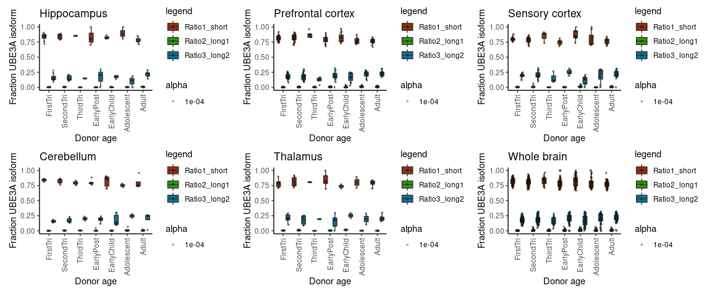
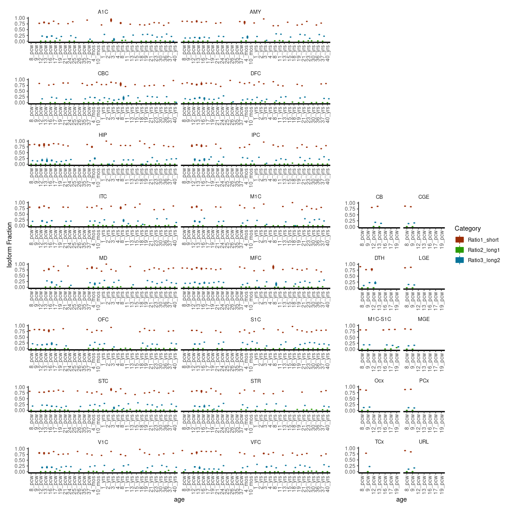
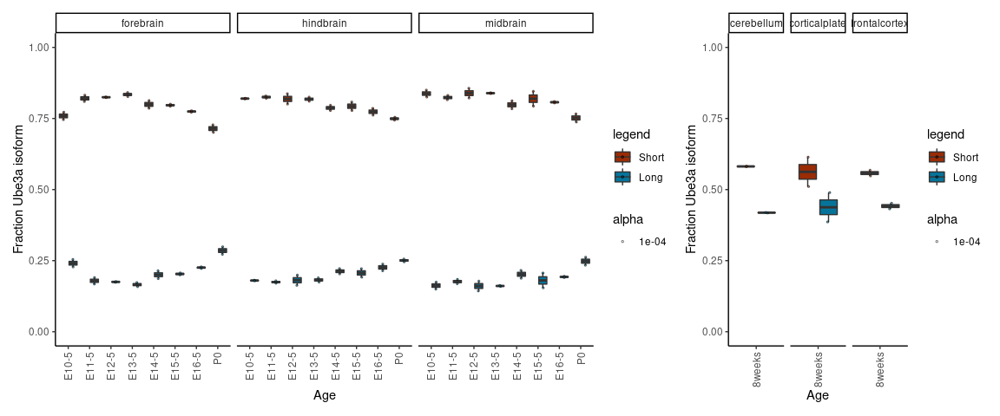

## Judson et al. 2020 (in preparation)

This repository contains `R` code to generate some of the figures presented in Judson _et al._ 2020 (_in preparation_). 

We used publicly available RNA-seq data in mouse and human to demonstrate that the short isoform of UBE3A is expressed preferentially over the long isoforms. 

Mouse ENCODE RNA-seq alignment bigWig files for developmental timepoints (E10.5 - P0) were downloaded from [ENCODE](https://www.encodeproject.org) under project series ENCSR505AHT, ENCSR328UYN, and ENCSR443OEA for midbrain, hindbrain, and forebrain, respectively. 

Alignment files corresponding to adult tissues were similarly downloaded for experiments ENCSR000BZM, ENCSR000BZR, and ENCSR000BZS for cerebellum, cortical plate, and frontal cortex, respectively. 

Signal over exons corresponding to start sites of the short (chr7:59247173-59247217) and long (chr7:59243350-59243469) isoforms (mm10 reference) were tabulated using [deeptools multiBigwigSummary](https://deeptools.readthedocs.io/en/develop/content/tools/multiBigwigSummary.html). 

Isoform fractions were then computed as Short/(Short+Long) or Long/(Short+Long) in R, as demonstrated here. Error bars represent the standard deviation in isoform fraction.

Human RNA-seq data summarized to exons were obtained from [BrainSpan](http://www.brainspan.org/static/download.html), and filtered for UBE3A exons as annotated by [Gencode v10](https://www.gencodegenes.org/human/release_10.html). 

Expression values were then averaged over developmental epochs for each exon and broader brain area. 

Epochs were defined as: 

* 1st trimester (8-13 pcw)
* 2nd trimester (16-25 pcw)
* 3rd trimester (26-37 pcw)
* Early Postnatal (4 months - 2 years)
* Early Childhood (3-11 years)
* Adolescent (13-19 years)
* Adult (19-40 years)

Brain areas were defined as: 

* Hippocampus (HIP)
* Prefrontal Cortex (DFC, VFC, MFC, OFC)
* Sensory Cortex (S1C, A1C, M1C, M1C-S1C)
* Cerebellum (CB, CBC)
* Thalamus (DTH, MD) 

Isoform fractions were then calculated by taking signal from exons corresponding to start sites of isoform 1 (short; chr15:25620611-25620910 and chr15:25652213-25652284), isoform 2 (long; chr15:25653766-25653795), and isoform 3 (long; chr15:25654234-25654354) and computed as Short/(Short+Long) or Long/(Short+Long) in R, as demonstrated here. 

Error bars for human RNA-seq data represent the 95% confidence intervals from 10,000 bootstrap samples of the data with replacement, and were computed in `R` using the [`rsample`](https://cran.r-project.org/web/packages/rsample/index.html) package. Plots were generated in `R` version 3.6.0 and plotted with `ggplot2`

## Load packages 

```
library(vctrs)
library(rsample)
library(tidyverse)
library(magrittr)
library(patchwork)
```


## Read in human data

The data from BrainSpan come as a set of 3 files:

* `expression_matrix.csv` -- the rows are genes and the columns samples; the first column is the row number
* `rows_metadata.csv` -- the exons are listed in the same order as the rows in expression_matrix.csv
* `columns_metadata.csv` -- the samples are listed in the same order as the columns in expression_matrix.csv

Here we have created a lookup table to annotate the UBE3A exons based on their coordinates as follows:

`rows_metadata_UBE3A_lookup.txt`

```
65047	UBE3A_chr15_25582380_25584404
65048	UBE3A_chr15_25585231_25585375
65049	UBE3A_chr15_25599499_25599573
65050	UBE3A_chr15_25599674_25599830
65051	UBE3A_chr15_25601038_25601203
65052	UBE3A_chr15_25601837_25602043
65053	UBE3A_chr15_25605529_25605674
65054	UBE3A_chr15_25615712_25616959
65055	UBE3A_chr15_25620611_25620910
65056	UBE3A_chr15_25650607_25650653
65057	UBE3A_chr15_25652213_25652284
65058	UBE3A_chr15_25653766_25653795
65059	UBE3A_chr15_25654234_25654354
65060	UBE3A_chr15_25657054_25657118
65061	UBE3A_chr15_25658157_25658175
65062	UBE3A_chr15_25683635_25684128
```

We have also subset the expression matrix to contain just these UBE3A exons, such that `expression_matrix_UBE3A.csv` contains only exons 65047-65062.

Now we can read in the data and begin to tidy:


```
## Parsed with column specification:
## cols(
##   .default = col_double()
## )
```

```
## See spec(...) for full column specifications.
```

```
## Parsed with column specification:
## cols(
##   ExonID = col_double(),
##   Name = col_character()
## )
```

```
## Parsed with column specification:
## cols(
##   column_num = col_double(),
##   donor_id = col_double(),
##   donor_name = col_character(),
##   age = col_character(),
##   gender = col_character(),
##   structure_id = col_double(),
##   structure_acronym = col_character(),
##   structure_name = col_character()
## )
```

Next we can annotate the ages as each of the developmental epochs we defined above


Then we manually set the order that these ages and epochs should appear in figures, and set a default jitter width


```
Note: Number of bootstraps set to 100 here, but for publication we ran 10,000 bootstraps
```

### Summarize and plot data for whole brain


```
## Joining, by = c("Epoch", "Category")
```

### Summarize and plot data for Hippocampus


```
## Joining, by = c("Epoch", "Category")
```

### Summarize and plot data for Prefrontal cortex


```
## Joining, by = c("Epoch", "Category")
```

### Summarize and plot data for Sensory cortex


```
## Joining, by = c("Epoch", "Category")
```

### Summarize and plot data for Cerebellum


```
## Joining, by = c("Epoch", "Category")
```

### Summarize and plot data for Thalamus


```
## Joining, by = c("Epoch", "Category")
```

### Write out all summary plots to one figure using patchwork



### Plot all individual brain regions and timepoints as boxplots for supplementary material



******

## Read in mouse data

The data from ENCODE come as a set of bigWig files, and the downloads do not preserve meaningful sample names. We renamed them as follows:

```
ENCFF739IFQ.bigWig	Mouse_E11-5_midbrain_RNA_Rep1.bigWig
ENCFF933JNJ.bigWig	Mouse_E11-5_midbrain_RNA_Rep2.bigWig
ENCFF931YZK.bigWig	Mouse_E12-5_midbrain_RNA_Rep1.bigWig
ENCFF314WTG.bigWig	Mouse_E12-5_midbrain_RNA_Rep2.bigWig
ENCFF864PZZ.bigWig	Mouse_E16-5_midbrain_RNA_Rep1.bigWig
ENCFF156ZZJ.bigWig	Mouse_E16-5_midbrain_RNA_Rep2.bigWig
ENCFF750QEC.bigWig	Mouse_E13-5_midbrain_RNA_Rep1.bigWig
ENCFF670KUK.bigWig	Mouse_E13-5_midbrain_RNA_Rep2.bigWig
ENCFF931VUS.bigWig	Mouse_E10-5_midbrain_RNA_Rep1.bigWig
ENCFF419AKF.bigWig	Mouse_E10-5_midbrain_RNA_Rep2.bigWig
ENCFF398USF.bigWig	Mouse_P0_midbrain_RNA_Rep1.bigWig
ENCFF494IKM.bigWig	Mouse_P0_midbrain_RNA_Rep2.bigWig
ENCFF112LWR.bigWig	Mouse_E14-5_midbrain_RNA_Rep1.bigWig
ENCFF957OON.bigWig	Mouse_E14-5_midbrain_RNA_Rep2.bigWig
ENCFF287UJS.bigWig	Mouse_E15-5_midbrain_RNA_Rep1.bigWig
ENCFF234TQI.bigWig	Mouse_E15-5_midbrain_RNA_Rep2.bigWig
ENCFF622NTO.bigWig	Mouse_E11-5_hindbrain_RNA_Rep1.bigWig
ENCFF568XIY.bigWig	Mouse_E11-5_hindbrain_RNA_Rep2.bigWig
ENCFF852ZHY.bigWig	Mouse_P0_hindbrain_RNA_Rep1.bigWig
ENCFF387KWS.bigWig	Mouse_P0_hindbrain_RNA_Rep2.bigWig
ENCFF235YXS.bigWig	Mouse_E12-5_hindbrain_RNA_Rep1.bigWig
ENCFF422MYW.bigWig	Mouse_E12-5_hindbrain_RNA_Rep2.bigWig
ENCFF372BPJ.bigWig	Mouse_E13-5_hindbrain_RNA_Rep1.bigWig
ENCFF308BKU.bigWig	Mouse_E13-5_hindbrain_RNA_Rep2.bigWig
ENCFF804RYC.bigWig	Mouse_E16-5_hindbrain_RNA_Rep1.bigWig
ENCFF556CUO.bigWig	Mouse_E16-5_hindbrain_RNA_Rep2.bigWig
ENCFF215SES.bigWig	Mouse_E15-5_hindbrain_RNA_Rep1.bigWig
ENCFF574ADS.bigWig	Mouse_E15-5_hindbrain_RNA_Rep2.bigWig
ENCFF965BZR.bigWig	Mouse_E10-5_hindbrain_RNA_Rep1.bigWig
ENCFF844SJF.bigWig	Mouse_E10-5_hindbrain_RNA_Rep2.bigWig
ENCFF484FNM.bigWig	Mouse_E14-5_hindbrain_RNA_Rep1.bigWig
ENCFF222ONA.bigWig	Mouse_E14-5_hindbrain_RNA_Rep2.bigWig
ENCFF275ARE.bigWig	Mouse_E11-5_forebrain_RNA_Rep1.bigWig
ENCFF010POZ.bigWig	Mouse_E11-5_forebrain_RNA_Rep2.bigWig
ENCFF527YNH.bigWig	Mouse_E12-5_forebrain_RNA_Rep1.bigWig
ENCFF793AHG.bigWig	Mouse_E12-5_forebrain_RNA_Rep2.bigWig
ENCFF242VUV.bigWig	Mouse_E14-5_forebrain_RNA_Rep1.bigWig
ENCFF136BXC.bigWig	Mouse_E14-5_forebrain_RNA_Rep2.bigWig
ENCFF130CQI.bigWig	Mouse_E16-5_forebrain_RNA_Rep1.bigWig
ENCFF459EHB.bigWig	Mouse_E16-5_forebrain_RNA_Rep2.bigWig
ENCFF370MZR.bigWig	Mouse_E15-5_forebrain_RNA_Rep1.bigWig
ENCFF599MHQ.bigWig	Mouse_E15-5_forebrain_RNA_Rep2.bigWig
ENCFF046NCT.bigWig	Mouse_E10-5_forebrain_RNA_Rep1.bigWig
ENCFF252SXR.bigWig	Mouse_E10-5_forebrain_RNA_Rep2.bigWig
ENCFF190EHR.bigWig	Mouse_P0_forebrain_RNA_Rep1.bigWig
ENCFF372TAA.bigWig	Mouse_P0_forebrain_RNA_Rep2.bigWig
ENCFF652LRB.bigWig	Mouse_E13-5_forebrain_RNA_Rep1.bigWig
ENCFF796UNM.bigWig	Mouse_E13-5_forebrain_RNA_Rep2.bigWig
ENCFF042QUM.bigWig	Mouse_8weeks_cerebellum_RNA_Rep1.bigWig
ENCFF617YNX.bigWig	Mouse_8weeks_cerebellum_RNA_Rep2.bigWig
ENCFF842OHF.bigWig	Mouse_8weeks_corticalplate_RNA_Rep1.bigWig
ENCFF595GCD.bigWig	Mouse_8weeks_corticalplate_RNA_Rep2.bigWig
ENCFF195XVM.bigWig	Mouse_8weeks_frontalcortex_RNA_Rep1.bigWig
ENCFF659CEH.bigWig	Mouse_8weeks_frontalcortex_RNA_Rep2.bigWig
```

We then ran deeptools multiBigWigSummary to compute exon level coverages

```
multiBigwigSummary BED-file -b Mouse_8weeks_cerebellum_RNA_Rep1.bigWig Mouse_8weeks_cerebellum_RNA_Rep2.bigWig Mouse_8weeks_corticalplate_RNA_Rep1.bigWig Mouse_8weeks_corticalplate_RNA_Rep2.bigWig Mouse_8weeks_frontalcortex_RNA_Rep1.bigWig Mouse_8weeks_frontalcortex_RNA_Rep2.bigWig Mouse_E10-5_forebrain_RNA_Rep1.bigWig Mouse_E10-5_forebrain_RNA_Rep2.bigWig Mouse_E10-5_hindbrain_RNA_Rep1.bigWig Mouse_E10-5_hindbrain_RNA_Rep2.bigWig Mouse_E10-5_midbrain_RNA_Rep1.bigWig Mouse_E10-5_midbrain_RNA_Rep2.bigWig Mouse_E11-5_forebrain_RNA_Rep1.bigWig Mouse_E11-5_forebrain_RNA_Rep2.bigWig Mouse_E11-5_hindbrain_RNA_Rep1.bigWig Mouse_E11-5_hindbrain_RNA_Rep2.bigWig Mouse_E11-5_midbrain_RNA_Rep1.bigWig Mouse_E11-5_midbrain_RNA_Rep2.bigWig Mouse_E12-5_forebrain_RNA_Rep1.bigWig Mouse_E12-5_forebrain_RNA_Rep2.bigWig Mouse_E12-5_hindbrain_RNA_Rep1.bigWig Mouse_E12-5_hindbrain_RNA_Rep2.bigWig Mouse_E12-5_midbrain_RNA_Rep1.bigWig Mouse_E12-5_midbrain_RNA_Rep2.bigWig Mouse_E13-5_forebrain_RNA_Rep1.bigWig Mouse_E13-5_forebrain_RNA_Rep2.bigWig Mouse_E13-5_hindbrain_RNA_Rep1.bigWig Mouse_E13-5_hindbrain_RNA_Rep2.bigWig Mouse_E13-5_midbrain_RNA_Rep1.bigWig Mouse_E13-5_midbrain_RNA_Rep2.bigWig Mouse_E14-5_forebrain_RNA_Rep1.bigWig Mouse_E14-5_forebrain_RNA_Rep2.bigWig Mouse_E14-5_hindbrain_RNA_Rep1.bigWig Mouse_E14-5_hindbrain_RNA_Rep2.bigWig Mouse_E14-5_midbrain_RNA_Rep1.bigWig Mouse_E14-5_midbrain_RNA_Rep2.bigWig Mouse_E15-5_forebrain_RNA_Rep1.bigWig Mouse_E15-5_forebrain_RNA_Rep2.bigWig Mouse_E15-5_hindbrain_RNA_Rep1.bigWig Mouse_E15-5_hindbrain_RNA_Rep2.bigWig Mouse_E15-5_midbrain_RNA_Rep1.bigWig Mouse_E15-5_midbrain_RNA_Rep2.bigWig Mouse_E16-5_forebrain_RNA_Rep1.bigWig Mouse_E16-5_forebrain_RNA_Rep2.bigWig Mouse_E16-5_hindbrain_RNA_Rep1.bigWig Mouse_E16-5_hindbrain_RNA_Rep2.bigWig Mouse_E16-5_midbrain_RNA_Rep1.bigWig Mouse_E16-5_midbrain_RNA_Rep2.bigWig Mouse_P0_forebrain_RNA_Rep1.bigWig Mouse_P0_forebrain_RNA_Rep2.bigWig Mouse_P0_hindbrain_RNA_Rep1.bigWig Mouse_P0_hindbrain_RNA_Rep2.bigWig Mouse_P0_midbrain_RNA_Rep1.bigWig Mouse_P0_midbrain_RNA_Rep2.bigWig -o ENCODE_mouse_dev_timecourse_bigWigSummary_Ube3a_isoforms.npz -p 4 --outRawCounts ENCODE_mouse_dev_timecourse_bigWigSummary_Ube3a_isoforms.rawcounts.tab --smartLabels --BED ube3a.bed

```

Where `ube3a.bed` contains the following information about isoform start sites:

```
chr7    59243350        59243469        long
chr7    59247173        59247217        short
```

The header line of the `.tab` output from deeptools was cleaned up slightly to give us the file provided here `ENCODE_mouse_dev_timecourse_bigWigSummary_Ube3a_isoforms.rawcounts.txt`, which we can now read into `R`


```
## Parsed with column specification:
## cols(
##   .default = col_double(),
##   chr = col_character()
## )
```

```
## See spec(...) for full column specifications.
```

## Summarize and plot data for developmental timepoints


## Summarize and plot data for adult mouse brain


## Write out plots to one figure using patchwork



