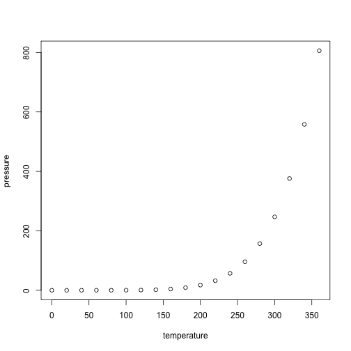

## Judson et al. 2020 (in preparation)

This repository contains `R` code to generate some of the figures presented in Judson _et al._ 2020 (_in preparation_). 

We used publicly available RNA-seq data in mouse and human to demonstrate that the short isoform of UBE3A is expressed preferentially over the long isoforms. 

Mouse ENCODE RNA-seq alignment bigWig files for developmental timepoints (E10.5 - P0) were downloaded from [ENCODE](https://www.encodeproject.org) under project series ENCSR505AHT, ENCSR328UYN, and ENCSR443OEA for midbrain, hindbrain, and forebrain, respectively. 

Alignment files corresponding to adult tissues were similarly downloaded for experiments ENCSR000BZM, ENCSR000BZR, and ENCSR000BZS for cerebellum, cortical plate, and frontal cortex, respectively. 

Signal over exons corresponding to start sites of the short (chr7:59247173-59247217) and long (chr7:59243350-59243469) isoforms (mm10 reference) were tabulated using [deeptools multiBigwigSummary](https://deeptools.readthedocs.io/en/develop/content/tools/multiBigwigSummary.html). 

Isoform fractions were then computed as Short/(Short+Long) or Long/(Short+Long) in R, as demonstrated here. Error bars represent the standard deviation in isoform fraction.

Human RNA-seq data summarized to exons were obtained from [BrainSpan](http://www.brainspan.org/static/download.html), and filtered for UBE3A exons as annotated by [Gencode v10](https://www.gencodegenes.org/human/release_10.html). 

Expression values were then averaged over developmental epochs for each exon and broader brain area. 

Epochs were defined as: 

* 1st trimester (8-13 pcw)
* 2nd trimester (16-25 pcw)
* 3rd trimester (26-37 pcw)
* Early Postnatal (4 months - 2 years)
* Early Childhood (3-11 years)
* Adolescent (13-19 years)
* Adult (19-40 years)

Brain areas were defined as: 

* Hippocampus (HIP)
* Prefrontal Cortex (DFC, VFC, MFC, OFC)
* Sensory Cortex (S1C, A1C, M1C, M1C-S1C)
* Cerebellum (CB, CBC)
* Thalamus (DTH, MD) 

Isoform fractions were then calculated by taking signal from exons corresponding to start sites of isoform 1 (short; chr15:25620611-25620910 and chr15:25652213-25652284), isoform 2 (long; chr15:25653766-25653795), and isoform 3 (long; chr15:25654234-25654354) and computed as Short/(Short+Long) or Long/(Short+Long) in R, as demonstrated here. 

Error bars for human RNA-seq data represent the 95% confidence intervals from 10,000 bootstrap samples of the data with replacement, and were computed in `R` using the [`rsample`](https://cran.r-project.org/web/packages/rsample/index.html) package. Plots were generated in R version 3.5 and plotted with ggplot2

 


```r
summary(cars)
```

```
##      speed           dist       
##  Min.   : 4.0   Min.   :  2.00  
##  1st Qu.:12.0   1st Qu.: 26.00  
##  Median :15.0   Median : 36.00  
##  Mean   :15.4   Mean   : 42.98  
##  3rd Qu.:19.0   3rd Qu.: 56.00  
##  Max.   :25.0   Max.   :120.00
```

## Including Plots

You can also embed plots, for example:



Note that the `echo = FALSE` parameter was added to the code chunk to prevent printing of the R code that generated the plot.

